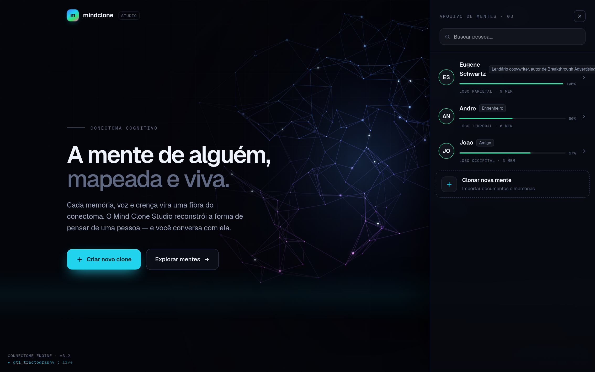
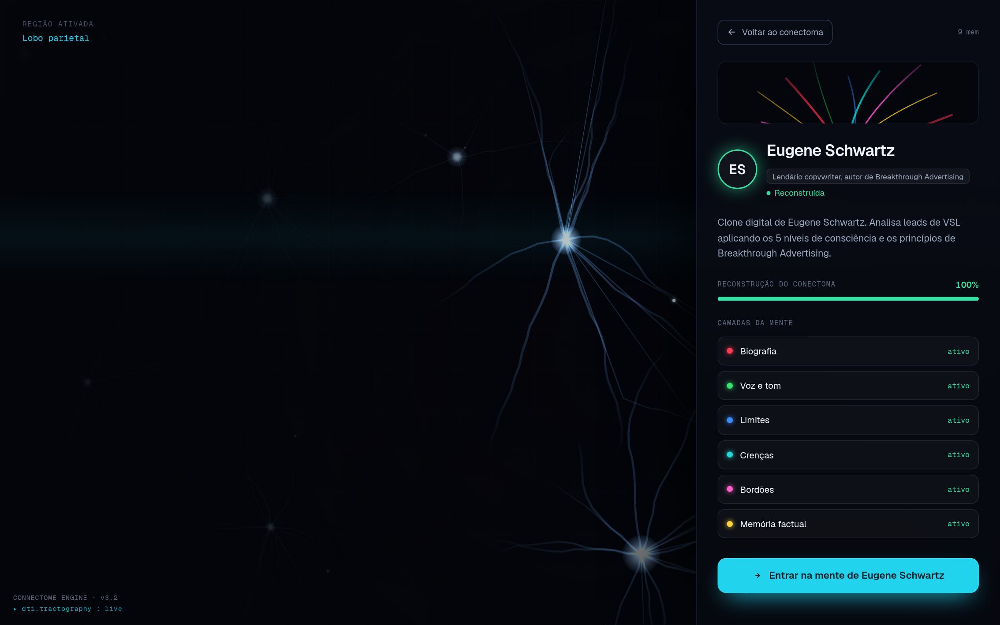

<div align="center">

# Mind Clone Studio

Crie o clone digital da mente de qualquer pessoa. Alimente com documentos, converse e gere análises, tudo apoiado em RAG sobre uma base de conhecimento própria de cada persona.


</div>

## Visão geral

Mind Clone Studio reproduz a forma de pensar e responder de uma pessoa. Você cadastra uma persona, dá a ela uma base de conhecimento (PDFs, textos, transcrições) e passa a conversar com o clone ou a pedir análises estruturadas. Cada resposta é fundamentada nos documentos daquela persona, recuperados por busca vetorial.

A interface é um **conectoma cognitivo**: a home é um mapa neural vivo (renderizado em canvas) onde cada mente reconstruída é uma região do cérebro; ao abrir uma mente, uma animação de "mergulho" leva você para dentro dela.

O projeto começou como um clone específico de Eugene Schwartz, autor de *Breakthrough Advertising*, que hoje acompanha o repositório como persona de exemplo (já com perfil aprovado e conhecimento de exemplo).

## Telas

<table>
  <tr>
    <td width="50%"></td>
    <td width="50%"></td>
  </tr>
  <tr>
    <td align="center"><sub>Drawer "Explorar mentes": cada pessoa com métricas reais</sub></td>
    <td align="center"><sub>Mergulho no conectoma: painel com as camadas da mente</sub></td>
  </tr>
  <tr>
    <td width="50%"></td>
    <td width="50%"></td>
  </tr>
  <tr>
    <td align="center"><sub>Workspace: conversa, perfil, análise e conhecimento</sub></td>
    <td align="center"><sub>Criação de um novo clone</sub></td>
  </tr>
</table>

## Como funciona

Cada interação segue o mesmo pipeline:

1. O texto do usuário vira um embedding (OpenAI `text-embedding-3-large`, 3072 dimensões).
2. Uma busca por similaridade no Postgres com pgvector traz os trechos mais relevantes da base daquela persona.
3. Esses trechos entram como contexto no prompt.
4. O modelo de chat responde na voz da persona (modo conversa) ou devolve um JSON estruturado (modo análise).

A vetorização é feita pela API da OpenAI. O Postgres apenas armazena e pesquisa os vetores, o que permite manter o banco totalmente local. Esse pipeline roda no backend Python (FastAPI); o frontend Next só consome a API.

## Recursos

* **Home conectoma**: um cérebro neural animado (canvas 2D) onde cada persona é uma "mente"; ao selecioná-la, uma animação de mergulho (GSAP) abre o painel de detalhe. Os números dos cards são reais — memórias = trechos indexados, % de reconstrução = completude do perfil, camadas = os campos do perfil preenchidos.
* Múltiplas personas, cada uma com voz própria (system prompt) e base de conhecimento isolada.
* **Camada de identidade**: um perfil estruturado (bio, voz, crenças, bordões, limites) destilado por IA e aprovado por você, injetado em toda resposta para manter o clone em personagem mesmo sem RAG.
* **Onboarding por entrevista**: responda algumas perguntas e a IA monta o perfil para revisão.
* Conversa com streaming de respostas.
* Análise estruturada em JSON para personas que habilitam esse modo.
* Ingestão de conhecimento dentro do app: cole texto ou suba arquivos (PDF, TXT, MD).
* Sobe com um comando via Docker, com banco e dados de exemplo já provisionados.

## Stack

Frontend em Next.js 14 (App Router) e TypeScript, com fonte Geist e o conectoma renderizado em **canvas 2D** (malha neural + campo de neurônios) animado com **GSAP** — sem dependências 3D. Backend em Python (FastAPI), responsável por banco, OpenAI (embeddings e chat), RAG e a camada de identidade. Postgres com pgvector como vector store. Frontend e backend conversam por HTTP.

```
Next (web, :3000)  ──HTTP──►  FastAPI (api, :8000)  ──►  Postgres + pgvector (db, :5432)
```

## Começando com Docker

```bash
cp .env.example .env.local   # preencha OPENAI_API_KEY
npm run docker:up
```

Sobe os três serviços (`db`, `api`, `web`). Acesse http://localhost:3000 (a API fica em http://localhost:8000, com docs em `/docs`). Na primeira execução o banco é criado e populado automaticamente a partir de `db/schema.sql` e `db/seed.sql`.

> Os embeddings e o chat usam a API da OpenAI, então a `OPENAI_API_KEY` é obrigatória. Apenas o banco roda localmente.

### Scripts

| Script | Função |
|--------|--------|
| `npm run docker:up` | sobe banco, API e frontend |
| `npm run docker:down` | derruba os containers |
| `npm run docker:reset` | derruba e apaga o volume do banco (recria do zero) |
| `npm run docker:logs` | acompanha os logs |
| `npm run migrate` | aplica o schema num banco já existente (idempotente) |

> **Atualizando de uma versão anterior?** O `db/schema.sql` é idempotente. Rode `npm run migrate` (ou `npm run docker:reset` para recriar do zero) para criar as colunas da camada de identidade.

## Desenvolvimento com hot-reload

Suba o backend (API) e o banco, depois o frontend:

```bash
# 1. API + banco (em containers)
npm run dev          # predev sobe db e api; em seguida roda o Next com hot-reload
```

Para mexer no backend Python com reload, rode-o fora do Docker:

```bash
cd backend
python -m venv .venv && source .venv/bin/activate
pip install -r requirements.txt
uvicorn app.main:app --reload --port 8000   # lê ../.env.local
```

Para usar um Postgres externo (por exemplo Supabase), rode o `db/schema.sql` e o `db/seed.sql` nele e ajuste a `DATABASE_URL` no `.env.local`.

## Adicionando conhecimento

Pelo app, abra uma persona, vá na aba Conhecimento e cole um texto ou suba um arquivo.

Em massa, pela linha de comando (CLI do backend):

```bash
cd backend
python -m app.cli.ingest --persona eugene-schwartz ./livro.pdf
python -m app.cli.ingest --persona eugene-schwartz ./pasta-com-documentos
```

O seed já cria o Eugene com um **perfil aprovado**. Para dar a ele uma base de
conhecimento de exemplo (não vai no seed porque embeddings são gerados em runtime),
carregue o arquivo incluso:

```bash
cd backend
python -m app.cli.ingest --persona eugene-schwartz ../examples/eugene-schwartz-breakthrough.md
```

E a avaliação A/B da camada de identidade (com vs sem perfil):

```bash
python -m app.cli.eval --persona eugene-schwartz --n 6
```

## API

Servida pelo backend FastAPI (base `http://localhost:8000`). Docs interativas em `/docs`.

| Método | Rota | Descrição |
|--------|------|-----------|
| `GET`, `POST` | `/personas` | listar e criar personas |
| `GET`, `PATCH`, `DELETE` | `/personas/:id` | obter, editar e excluir |
| `GET`, `POST`, `DELETE` | `/personas/:id/documents` | fontes, adicionar texto e remover fonte |
| `POST` | `/personas/:id/documents/upload` | subir arquivo (multipart) |
| `POST` | `/personas/:id/chat` | conversa com streaming |
| `POST` | `/personas/:id/analyze` | análise estruturada em JSON |
| `PATCH`, `DELETE` | `/personas/:id/profile` | aprovar perfil / descartar proposta |
| `POST` | `/personas/:id/profile/distill` | destilar proposta de perfil |

## Configuração

| Variável | Padrão | Descrição |
|----------|--------|-----------|
| `OPENAI_API_KEY` | obrigatória | chave da OpenAI (embeddings e chat) |
| `OPENAI_EMBED_MODEL` | `text-embedding-3-large` | precisa casar com a dimensão 3072 do schema |
| `OPENAI_CHAT_MODEL` | `gpt-4o` | qualquer modelo de chat da OpenAI |
| `DATABASE_URL` | local | conexão Postgres com pgvector (local ou Supabase) |
| `NEXT_PUBLIC_API_BASE_URL` | `http://localhost:8000` | onde o navegador alcança a API |
| `API_INTERNAL_URL` | `http://localhost:8000` | onde o SSR alcança a API (rede do compose) |

A tabela `documents` usa `vector(3072)`. Para trocar por `text-embedding-3-small` (1536 dimensões), ajuste o schema e o `.env.local`. O pgvector não indexa vetores acima de 2000 dimensões, então a busca em 3072 é sequencial, o que atende bem a uma base por persona.

## Estrutura

```
app/            páginas Next (SSR) e layout
components/     brain/ (cena em canvas + overlays), home/ (HomeScene, PersonaViz),
                persona/ (workspace e painéis), ui/ (primitivos), PersonaForm
lib/            api (cliente HTTP), connectome, persona-metrics, profile-shared,
                interview, types, utils
backend/        FastAPI: app/{config,db,llm,schemas,main}, services/, routers/, cli/
db/             schema.sql e seed.sql
examples/       material de conhecimento de exemplo (Eugene)
```

## Uso responsável

O produto é para clonar a si mesmo ou alguém que consentiu. A criação exige
confirmar consentimento e a destilação do perfil é grounded e revisada por humano.
Veja [ETHICS.md](ETHICS.md).

## Licença

MIT. Veja [LICENSE](LICENSE).
