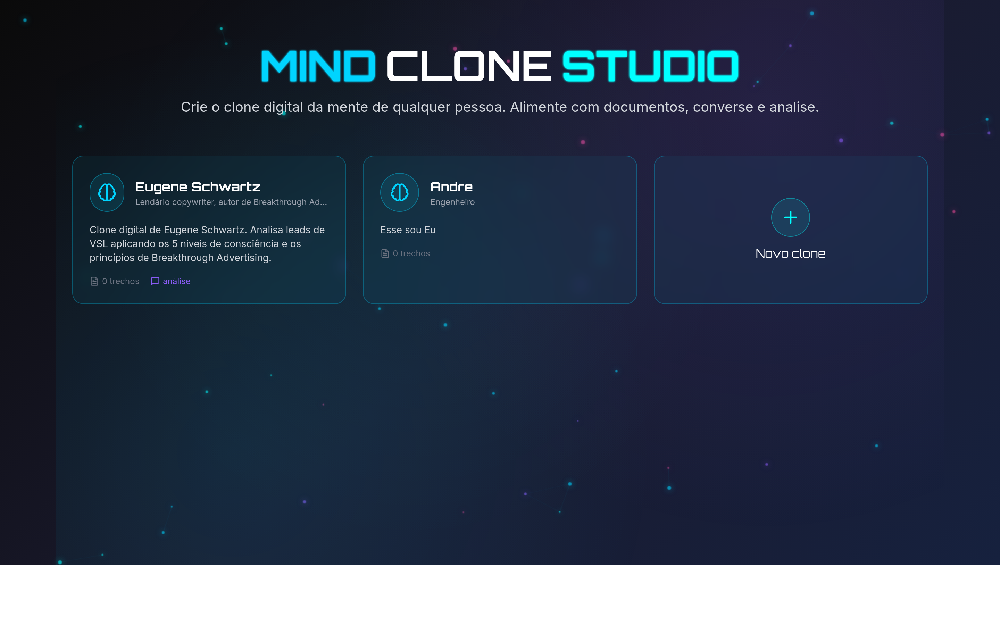
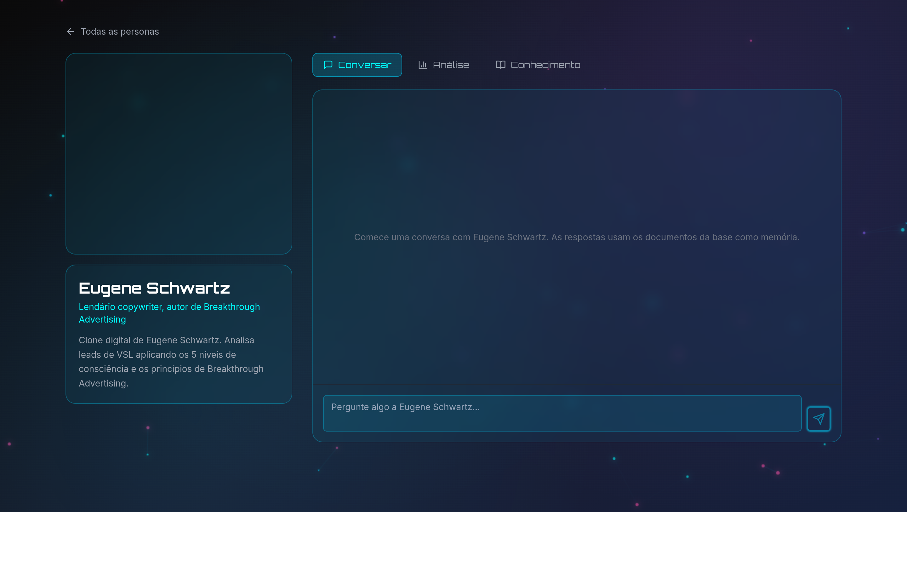
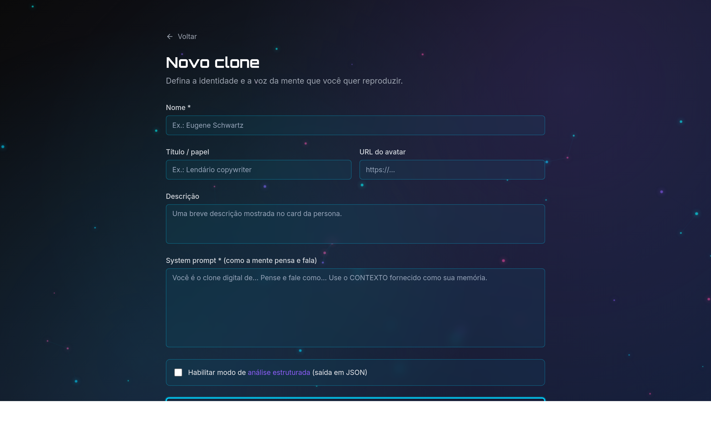

<div align="center">

# Mind Clone Studio

Crie o clone digital da mente de qualquer pessoa. Alimente com documentos, converse e gere análises, tudo apoiado em RAG sobre uma base de conhecimento própria de cada persona.




</div>

## Visão geral

Mind Clone Studio reproduz a forma de pensar e responder de uma pessoa. Você cadastra uma persona, dá a ela uma base de conhecimento (PDFs, textos, transcrições) e passa a conversar com o clone ou a pedir análises estruturadas. Cada resposta é fundamentada nos documentos daquela persona, recuperados por busca vetorial.

O projeto começou como um clone específico de Eugene Schwartz, autor de *Breakthrough Advertising*, que hoje acompanha o repositório como persona de exemplo.

## Telas

<table>
  <tr>
    <td width="50%"></td>
    <td width="50%"></td>
  </tr>
  <tr>
    <td align="center"><sub>Workspace da persona: conversa, análise e conhecimento</sub></td>
    <td align="center"><sub>Criação de um novo clone</sub></td>
  </tr>
</table>

## Como funciona

Cada interação segue o mesmo pipeline:

1. O texto do usuário vira um embedding (OpenAI `text-embedding-3-large`, 3072 dimensões).
2. Uma busca por similaridade no Postgres com pgvector traz os trechos mais relevantes da base daquela persona.
3. Esses trechos entram como contexto no prompt.
4. O modelo de chat responde na voz da persona (modo conversa) ou devolve um JSON estruturado (modo análise).

A vetorização é feita pela API da OpenAI. O Postgres apenas armazena e pesquisa os vetores, o que permite manter o banco totalmente local.

## Recursos

* Múltiplas personas, cada uma com voz própria (system prompt) e base de conhecimento isolada.
* Conversa com streaming de respostas.
* Análise estruturada em JSON para personas que habilitam esse modo.
* Ingestão de conhecimento dentro do app: cole texto ou suba arquivos (PDF, TXT, MD).
* Sobe com um comando via Docker, com banco e dados de exemplo já provisionados.

## Stack

Next.js 14 (App Router) e TypeScript, OpenAI para embeddings e chat, Postgres com pgvector como vector store, e Three.js na visualização do cérebro.

## Começando com Docker

```bash
cp .env.example .env.local   # preencha OPENAI_API_KEY
npm run docker:up
```

Acesse http://localhost:3000. Na primeira execução o banco é criado e populado automaticamente a partir de `db/schema.sql` e `db/seed.sql`.

> Os embeddings e o chat usam a API da OpenAI, então a `OPENAI_API_KEY` é obrigatória. Apenas o banco roda localmente.

### Scripts

| Script | Função |
|--------|--------|
| `npm run docker:up` | sobe o app e o banco |
| `npm run docker:down` | derruba os containers |
| `npm run docker:reset` | derruba e apaga o volume do banco (recria do zero) |
| `npm run docker:logs` | acompanha os logs |

## Desenvolvimento com hot-reload

```bash
npm run dev
```

O comando sobe o Postgres no Docker automaticamente (via `predev`) e inicia o Next com hot-reload. Para usar um Postgres externo (por exemplo Supabase), rode o `db/schema.sql` e o `db/seed.sql` nele, ajuste a `DATABASE_URL` no `.env.local` e use `npx next dev`.

## Adicionando conhecimento

Pelo app, abra uma persona, vá na aba Conhecimento e cole um texto ou suba um arquivo.

Em massa, pela linha de comando:

```bash
npm run ingest -- --persona eugene-schwartz ./livro.pdf
npm run ingest -- --persona eugene-schwartz ./pasta-com-documentos
```

## API

| Método | Rota | Descrição |
|--------|------|-----------|
| `GET`, `POST` | `/api/personas` | listar e criar personas |
| `GET`, `PATCH`, `DELETE` | `/api/personas/:id` | obter, editar e excluir |
| `GET`, `POST`, `DELETE` | `/api/personas/:id/documents` | fontes, adicionar texto e remover fonte |
| `POST` | `/api/personas/:id/documents/upload` | subir arquivo (multipart) |
| `POST` | `/api/personas/:id/chat` | conversa com streaming |
| `POST` | `/api/personas/:id/analyze` | análise estruturada em JSON |

## Configuração

| Variável | Padrão | Descrição |
|----------|--------|-----------|
| `OPENAI_API_KEY` | obrigatória | chave da OpenAI (embeddings e chat) |
| `OPENAI_EMBED_MODEL` | `text-embedding-3-large` | precisa casar com a dimensão 3072 do schema |
| `OPENAI_CHAT_MODEL` | `gpt-4o` | qualquer modelo de chat da OpenAI |
| `DATABASE_URL` | local | conexão Postgres com pgvector (local ou Supabase) |

A tabela `documents` usa `vector(3072)`. Para trocar por `text-embedding-3-small` (1536 dimensões), ajuste o schema e o `.env.local`. O pgvector não indexa vetores acima de 2000 dimensões, então a busca em 3072 é sequencial, o que atende bem a uma base por persona.

## Estrutura

```
app/            páginas e API routes
components/     UI (persona/, Brain3D, cards e formulários)
lib/            db, openai, rag, ingest, chunk, personas, documents, env, types
db/             schema.sql e seed.sql
scripts/        ingest.ts (CLI de ingestão)
```

## Licença

MIT. Veja [LICENSE](LICENSE).
